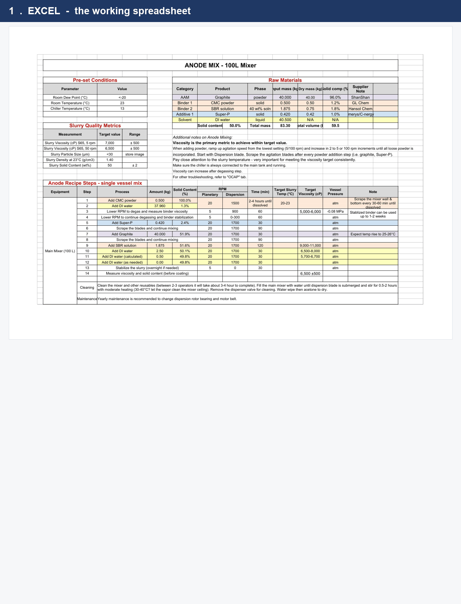
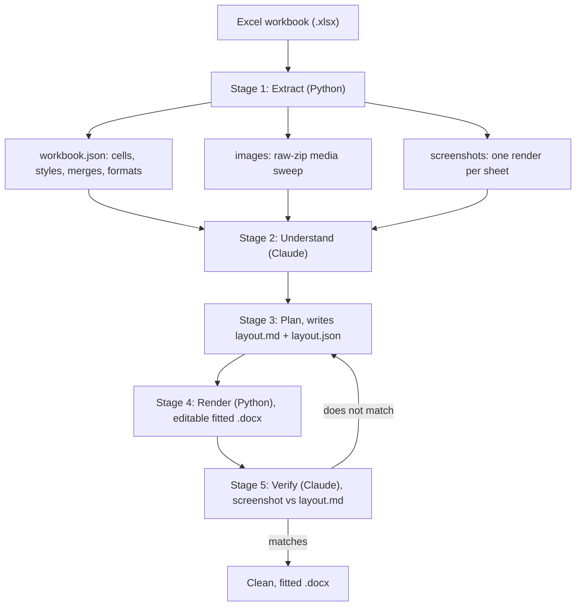

# xl2word

Turn an Excel workbook into a clean, publish-ready Word document, with tables that actually look like tables.



*The same sheet. Left: the working spreadsheet. Right: after xl2word reads it and composes it as documentation, with settings as a key list, notes as bullets, and only genuinely tabular data as tables.*

Most Excel-to-Word conversions fall apart on the tables. Columns spill off the page, merged cells break, number formatting disappears, and embedded images get dropped, so you spend more time fixing the output by hand than the conversion ever saved. xl2word solves this by splitting the work in two. Deterministic Python captures everything in the workbook so nothing is lost, and Claude designs the layout so the result looks right and fits the page.

The output is a real Word document. The tables are native and editable, not screenshots, so the recipient can select, copy, and change the values.

## How it works



The pipeline runs in five stages.

1. **Extract (Python).** A content-agnostic extractor reads the file format itself, so it behaves the same on a recipe spec, a data dump, or a financial model. It pulls every cell value plus its formatted display string, merges, fills, fonts, borders, alignment, number formats, hyperlinks, and notes. It then sweeps the raw `.xlsx` zip directly for every image, chart, and embedded object, which guarantees nothing is missed even when the high-level library does not expose it. Finally it renders each sheet to a screenshot. Output is `workbook.json`, an `images/` folder, and a `screenshots/` folder.

2. **Understand (Claude).** Claude reads the structured data and the screenshots together and works out the real structure of each sheet: which regions are tables, which rows are group headers, what each image is, and what the banner and footer are. The screenshot resolves anything the raw cells leave ambiguous.

3. **Plan (Claude).** Claude writes `layout.md`, a page-by-page design contract in plain English, and a matching `layout.json` the renderer consumes. This is the spec the final document gets measured against.

4. **Render (Python).** The renderer builds the `.docx` from the plan. Tables are native and editable, with merges, fills, borders, and number formats preserved, and every table is fitted to the page through column sizing, font sizing, or a switch to landscape. Images are placed inline with captions, and both Latin and CJK text render through a CJK-capable font.

5. **Verify (Claude).** Claude renders the finished document back to images and walks every page against `layout.md`. It checks that each table is present, fits the page, sits on a single page where possible, keeps its merges, and looks clean rather than cramped. It fixes any mismatch and re-renders, and it does not stop at the first pass.

## Why the split

Code is good at capture and bad at taste, and a model is the opposite. Getting data out of a workbook is a reliability problem, where a single missed image is invisible until a customer notices, so it belongs in deterministic, tested code. Making a wide table fit neatly on one page is a design problem with no single right answer, so it belongs to a model that can look at the rendered result and judge it. Putting each job where it is strongest is the whole idea, and it is why the tables come out clean instead of mangled.

## Install

```bash
pip install -e ".[dev]"
```

Rendering and visual verification also need LibreOffice, which provides the `soffice` command:

```bash
# macOS
brew install --cask libreoffice
```

Python 3.11 or newer. The core dependencies are `openpyxl`, `python-docx`, `pymupdf`, and `pillow`.

## Usage

### Command line

The deterministic path runs extract and render with a sensible default layout, no model in the loop:

```bash
xl2word recipe.xlsx -o recipe.docx
```

Render against a designed layout instead of the default:

```bash
xl2word recipe.xlsx -o recipe.docx --layout layout.json
```

### As a Claude skill

The skill is the quality path. It runs all five stages, including the understand and verify steps that get the layout right, and it checks first that it is running on a strong enough model. Invoke the `xl2word` skill in Claude Code and point it at the workbook. See `SKILL.md` for the exact stage instructions.

## Example

Start with a spec sheet that has a merged title banner, grouped headers, a few comparison columns wider than a portrait page, percent and decimal columns, and an embedded diagram.

```bash
xl2word spec.xlsx -o spec.docx
```

The result is a Word document where the banner is a single merged, shaded header row, the comparison table is switched to landscape and sized so every column fits, the percentages and decimals read exactly as they did in Excel, blank cells stay blank instead of printing `None`, and the diagram sits inline with a caption. Every table stays editable.

## Project layout

```
xl2word/
  extract.py      # Stage 1: semantic read + raw-zip media sweep + orchestration
  render.py       # Stage 1c and 5: xlsx and docx to PNG via LibreOffice + PyMuPDF
  model.py        # the intermediate data model (Workbook, Sheet, Cell, Style, ...)
  cleaners.py     # number-format aware cell display strings
  fit.py          # column-width and orientation math
  layout.py       # the LayoutPlan contract and a default layout
  docx_write.py   # Stage 4: editable, styled, fitted Word tables
  verify.py       # Stage 5: render the output and flag tables wider than the page
  cli.py          # command line entry point
SKILL.md          # the Claude orchestration skill (preflight + five stages)
SPEC.md           # the design spec
PLAN.md           # the task-by-task implementation plan
tests/            # 31 tests, including a full end-to-end conversion
```

## Tests

```bash
python3 -m pytest -q
```

30 passing and 1 skipped. The skipped test is the LibreOffice render check, which runs once `soffice` is installed. The suite also passes with `-W error::FutureWarning`, so the output is free of deprecation warnings.

## Status and limits

This targets human-readable spec, recipe, and report workbooks, the kind with a handful of richly formatted sheets. It is not built for very large operational logs with hundreds of sheets. Live formulas use their stored values rather than being recomputed, theme and indexed cell colors fall back to the screenshot rather than an exact RGB, and a few exotic objects such as form controls are captured visually rather than rebuilt as editable content. The verify loop is what catches any layout the fitting math gets wrong.
